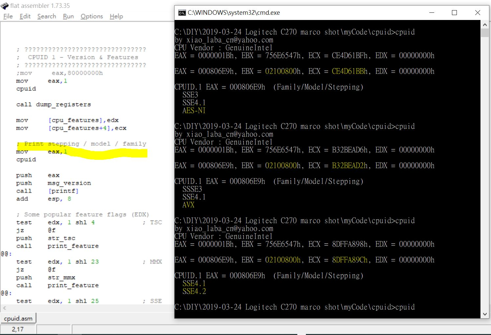

# FASM_win32_CPUID
x86, test CPUID, features are different each time ??? did not know why yet  

  

有人反映說某牌的電腦用了低等CPU, 冒充高等CPU賣貨.  
有人就使用 CPUID 來偵測並報告 CPU 的型號, AMD 表示不知情.  

x86 / x64 等 INTEL 兼容系列的 CPU 有 CPUID 指令, 可以直接看到 CPU 的等級或者型號, 當然知道奧秘的人仍然是可以偽造/變更的, 其中包括 CPU 的製造商, 行業的規則, 為了 FINAL TEST 後可以按照性能和表現升級或降級賣貨, 對外宣稱不會變動, 實際上是可以改的. CPU 超頻的意思是, 同樣的 CPU, 例如有的奔跑速度到 1GHz 就過熱不穩定, 另外那些奔跑速度到 1.5GHz 就還行, 那就編排不同的等級賣貨.  

CPUID, 參考 wiki  
https://en.wikipedia.org/wiki/CPUID  

https://www.tomshardware.com/pc-components/cpus/amd-claims-it-had-no-knowledge-of-fake-ryzen-5-7430u-cpus-in-chuwi-laptops-chinese-vendor-announces-recall-of-products-and-refunds-pcb-manufacturer-could-be-culprit
